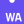
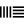

# Ey up, I'm Gethin

## Software // Data // Solutions

### About me

- 🏢&nbsp;I'm currently working on medical imaging software at **[Motilent]**
- 🐣&nbsp;I’m learning **Rust** 🦀 and **Haskell** 💜 when I have the time
- 🎨&nbsp;I occasionally make generative art [(have a look here)](#generative-art) and music
- 📖&nbsp;I'm reading _Modern Nature_ by Derek Jarman
- 🦜&nbsp;Hablo un poco de Español, e também falo Português... mas não muito.
- 💬&nbsp;I like talking about (but claim no expertise in) programming language theory, time-series, music and other wiggly lines 📈

### GitHub Stats

<figure>
    

        </img>
        </img>
    

</figure>

### Technologies I find useful or am interested by...

<table>
  <tr>
    <td align="center" width="96">
      
       VSCode
    </td>
    <td align="center" width="96">
      
       NeoVim
    </td>
    <td align="center" width="96">
      
       TypeScript
    </td>
    <td align="center" width="96">
      
       React
    </td>
    <td align="center" width="96">
      
       Python
    </td>
    <td align="center" width="96">
      
       &nbsp;&nbsp;R&nbsp;&nbsp;
    </td>  
    <td align="center" width="96"> 
      
       Docker
    </td>
    <td align="center" width="96">
      
       Git
    </td>
  </tr>
  <tr>
    <td align="center"  width="96">
      
       Rust
    </td>
    <td align="center"  width="96">
      
       WASM
    </td>
    <td align="center"  width="96">
      
       Haskell
    </td>
    <td align="center" width="96">
      
       Solid JS
    </td>
    <td align="center" width="96">
      
       PyTorch
    </td>
    <td align="center" width="96">
      
       Shiny
    </td>
    <td align="center" width="96">
      
       PostgreSQL
    </td>
    <td align="center"  width="96">
      
       Ableton Live
    </td>
  </tr>
</table>

#### Generative Art

  

CW // _Unreality_

  

<figure>
  

    </img>
    </img>
    </img>
    
<b>Surreal cityscapes generated using styleGAN.</b>

    
Network trained on aerial photographs scraped from Flickr. Animations generated by circilar interpolation of the constant layer input weights, and through the latent space. For details see <a href="https://github.com/dvschultz/stylegan2-ada-pytorch/pull/10">here</a>

  

</figure>

<figure>
  

    </img>
    
<b>Special effect glaze textures using styleGAN2</b>

    
Network trained on photographs of ceramic glazes (DWIGn dataset). Animations generated by circilar interpolation of the constant layer input weights, and through the latent space.

  

</figure>

<figure>
  </img>
  </img>
    
<b>Blended networks</b>

    
Network produced by splicing layers from a network trained on the FFHQ (faces) dataset, and my own DWIGn (ceramic glazes) dataset. Low resolution layers are from the FFHQ network, retaining some facial features. Textures and colours are generated in higher resolution layers from the DWIGn dataset. Animations generated by circilar interpolation of the constant layer input weights, and through the latent space.

</figure>

<!-- links -->

[motilent]: https://www.motilent.co.uk/ "Motilent Homepage"
[linkedin]: https://www.linkedin.com/in/grddavies "Gethin Davies LinkedIn"
